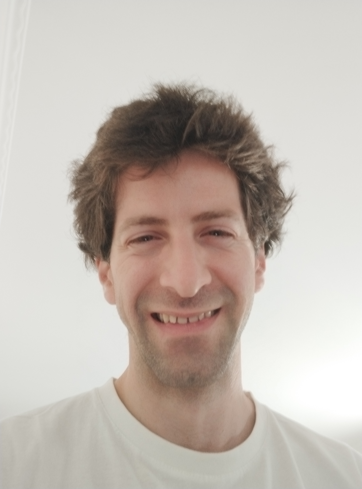

<!-- newest free version of fontawesome --->
<link rel="stylesheet" href="https://cdnjs.cloudflare.com/ajax/libs/font-awesome/6.4.2/css/all.min.css">

Aside
================================================================================

</img>

Contact Info {#contact}
--------------------------------------------------------------------------------

- <i class="fas fa-envelope"></i> bblodfon@gmail.com
- <i class="fab fa-github"></i> [github.com/bblodfon](https://github.com/bblodfon){target="_blank"}
- <i class="ai ai-google-scholar"></i> [Google Scholar](https://scholar.google.com/citations?user=6LDggVUAAAAJ&hl=en){target="_blank"}
- <i class="fas fa-phone"></i> +47 96808973
- <i class="fas fa-phone"></i> +30 6936586236

Skills {#skills}
--------------------------------------------------------------------------------
<i class="fab fa-r-project"></i> `R`

<i class="fas fa-microchip"></i> `mlr3/mlr3proba`

<i class="far fa-chart-bar"></i> `tidyverse`

<i class="fab fa-java"></i> `Java`

<i class="fab fa-python"></i> `Python`

<i class="fab fa-js"></i> `Javascript`

<i class="fab fa-html5"></i> `HTML/CSS`

<i class="fas fa-code-branch"></i> `Git`

Disclaimer {#disclaimer}
--------------------------------------------------------------------------------

<!-- Last updated on `r Sys.Date()`. -->

Main
================================================================================

John Zobolas {#title}
--------------------------------------------------------------------------------

My background is in computer science, with diverse expertise in computational modeling, software engineering, survival analysis and statistical/machine learning.
Being <b>an engineer at heart</b>, my strongest quality is careful, analytical thinking. 
I love <b>open-source software</b> and I am the current maintainer of <a href="http://github.com/mlr-org/mlr3proba">mlr3proba</a>.

Education {data-icon=graduation-cap data-concise=true}
--------------------------------------------------------------------------------

### Norwegian University of Science and Technology (NTNU)

PhD in Computational Biology

Trondheim

2021 - 2017

<u>**Thesis:**</u> *Software implementations allowing new approaches toward data analysis, modeling and curation of biological knowledge for Systems Medicine*  
[<a href="https://bblodfon.github.io/my-phd-thesis/" target="_blank">GitBook link</a> <i class="fab fa-github"></i>] [<a href="http://tiny.cc/john-phd-defence" target="_blank">Defence video</a> <i class="fab fa-youtube"></i>] [<a href="http://tiny.cc/john-phd-results" target="_blank">Results</a>] [<a href="http://tiny.cc/john-phd-diploma" target="_blank">Diploma</a>]

### Athens University of Economics and Business (AUEB)

MSc in Computer Science

Athens

2015 - 2013

<u>**Thesis:**</u> *SkyLighting Web Application with three.js* [<a href="https://github.com/bblodfon/skylighting-Web-app" target="_blank">GitHub link</a> <i class="fab fa-github"></i>]  
Diploma grade: **9.4/10** [<a href="http://tiny.cc/john-aueb-diploma" target="_blank">Diploma</a>] [<a href="http://tiny.cc/john-aueb-transcript" target="_blank">Transcript</a>]

### National Technical University of Athens (NTUA)

M.Eng in Electrical and Computer Engineering

Athens

2013 - 2007

<u>**Thesis:**</u> *Optimal Power Allocation in the uplink of Two-Tier Wireless Femtocell 
Networks* [<a href="https://github.com/bblodfon/femto-power-control" target="_blank">GitHub link</a> <i class="fab fa-github"></i>]  
Diploma grade: **8.4/10** [<a href="http://tiny.cc/john-ntua-diploma" target="_blank">Diploma</a>] [<a href="http://tiny.cc/john-ntua-transcript" target="_blank">Transcript</a>]

Professional Experience {data-icon=suitcase data-concise=true}
--------------------------------------------------------------------------------

### Postdoctoral Researcher in Clinical AI

Oslo University Hospital

Oslo

Sept 2025 - Jan 2022

- <u>**Project**</u>: PANCAIM - **Pancreatic cancer AI** for genomics and personalized medicine [[website](https://pancaim.eu/)]
- Authored two **AI-focused EU project deliverables** [<a href="https://zenodo.org/communities/pancaim/" target="_blank">Zenodo link</a>]
- Co-organized bi-weekly seminars at the Cancer Research Institute
- 'Visiting Fellow' at the **Center for Advanced Studies** (Winter Semester 2024/25), hosted by Dr. Andreas Bender, LMU Munich [[website](https://www.cas.lmu.de/en/)]

### Internship in Molecular AI group

AstraZeneca

Gothenburg

April 2021 - Jan 2021

- <u>**Project**</u>: Predicting bioactivity data using Matrix Factorization for target-based clustering and validation

### Research stay in Molecular Interactions Team

European Bioinformatics Institute

Hinxton, England

July 2018

- <u>**Project**</u>: Extending the PSICQUIC Java-based Web service platform to include causality information of molecular interactions

### Linux Systems Engineer and MariaDB Performance Optimization

Commsquare

Athens

2015 - 2013

Teaching {data-icon=person-chalkboard}
--------------------------------------------------------------------------------

### Intro to ML for Survival Analysis with mlr3 
Oslo Bioinformatics Workshop Week [<a href="https://www.mn.uio.no/sbi/english/events/oslo-bioinformatics-workshop-week-2023/index.html#05" target="_blank">workshop link</a>]

N/A

2023

### ML course for cancer researchers
Institute for Cancer Research in Oslo

N/A

2022

- Classification trees and model ensembles [[slides](http://tiny.cc/trees-ensembles)]
- Support Vector Machines [[slides](http://tiny.cc/svm-intro)]
- Neural Networks [[slides](http://tiny.cc/nn-intro)]
- Benchmarking ML models using the spam dataset [<a href="https://github.com/bblodfon/ml-course-2022/" target="_blank">GitBook link</a> <i class="fa-brands fa-github"></i></i>]

Supervision {data-icon=people-carry-box}
--------------------------------------------------------------------------------

### Alberto López
PhD student

N/A

2025 - 2023

- <u>**Project**</u>: Incomplete Multi-View Clustering Algorithms

### Philip Studener & Markus Goeswein
Student Assistants

N/A

2025 - 2024

- <u>**Project**</u>: Implementation of reduction techniques for Survival Analysis in *mlr3proba* [<a href="https://github.com/mlr-org/mlr3proba" target="_blank">GitHub link</a> <i class="fab fa-github"></i>]

### Laura Szekeres
Master student

N/A

2024

- <u>**Project**</u>: Cancer Treatment gets Logical: An Ensemble Boolean Modeling Pipeline in Python [<a href="https://github.com/druglogics/pydruglogics" target="_blank">GitHub link</a> <i class="fab fa-github"></i>]

### Tanguy Dumontier
Apprentice Data Engineer

N/A

2024

- <u>**Project**</u>: Optimizing Incomplete Multi-view Clustering: 
From MATLAB to Python

### Anjana Bhat
Master student

N/A

2024

- <u>**Project**</u>: Optimizing Clustering Metrics for Patient Stratification
using Heuristic Approaches [<a href="https://github.com/AnjuBhat247/Optimizing-Clustering-Metrics-for-Patient-Stratification" target="_blank">GitHub link</a> <i class="fab fa-github"></i>]

### Hedda Fjell Scheel
Veterinary Research Student (forskerlinjestudent)

N/A

2024 - 2023

- <u>**Project**</u>: Genetic Heterogeneity of Canine Mammary Tumors

Selected Talks {data-icon=chalkboard-user}
--------------------------------------------------------------------------------

### Intro to Machine Learning for Survival Analysis with mlr3

userR! 2024 conference tutorial [[GitHub link](https://survival-org.github.io/user2024-survival-mlr3/)]

Salzburg

July 2024

### Examining properness in the external validation of survival models with squared and logarithmic losses

NORA Annual conference 2024 [[slides](https://tiny.cc/scoring-rules-2024)]

Kristiansand

June 2024

### AI pitch: An example ML survival workflow

8th Annual NORBIS conference [[slides](http://tiny.cc/norbis-talk-2022)]

Rosendal

Oct 2022

### Reproducible Science

Logical modeling course BI8040 (NTNU) [[slides](http://tiny.cc/reproducibility)]

Trondheim

Aug 2022

Selected Publications {data-icon=book-open data-concise=true}
--------------------------------------------------------------------------------

### Tutorial on survival modeling with applications to omics data
[Bioinformatics](https://doi.org/10.1093/bioinformatics/btae132)

N/A

2024

### Fine tuning a logical model of cancer cells to predict drug synergies: combining manual curation and automated parameterization
[Frontiers in Systems Biology](https://doi.org/10.3389/fsysb.2023.1252961)

N/A

2023

### Boolean function metrics can assist modelers to check and choose logical rules
[Journal of Theoretical Biology](https://doi.org/10.1016/j.jtbi.2022.111025)

N/A

2022

### CausalTAB: the PSI-MITAB 2.8 updated format for signalling data representation and dissemination
[Bioinformatics](https://doi.org/10.1093/bioinformatics/btz132)

N/A

2019

<!-- \newpage -->

Online Books, Blogs {data-icon=book data-concise=true}
--------------------------------------------------------------------------------

### Survival modeling in mlr3 using Bayesian Additive Regression Trees (BART)

<a href="https://mlr-org.com/gallery/technical/2023-10-25-bart-survival/" target="_blank">mlr3 gallery</a>

N/A

2023

### *8 Rules to write a PhD Thesis*: A PhD Thesis Rulebook
<a href="https://bblodfon.github.io/phd-rules/index.html" target="_blank">Online GitBook</a> <i class="fab fa-github"></i>

N/A

2021

Awards/Scholarships {data-icon=award}
--------------------------------------------------------------------------------
### *Astri and Birger Torsteds* Grant to Fight Cancer

Received funding (50,000 NOK) to purchase IT equipment for cancer research related
to the PANCAIM EU project

N/A

2024

### Program *Study with Scholarship*, EqualSociety

Scholarship for the MSc in Computer Science (AUEB)

N/A

2013

### Program *Great Moment for Education*, Eurobank

Award for the highest grade in the Panhellenic examinations

N/A

2007

\newpage

Recreational Activities {data-icon=person-through-window}
--------------------------------------------------------------------------------

### <a href="https://www.youtube.com/c/JohnZobolas" target="_blank">Piano</a> <i class="fab fa-youtube"></i> <i class="fas fa-music"></i>

N/A

N/A

### <a href="https://www.instagram.com/bblodfon312/" target="_blank">Juggling/Unicycling/Acro-yoga</a> <i class="fab fa-instagram"></i>

N/A

N/A

### Swimming <i class="fa-solid fa-person-swimming"></i>

N/A

N/A

### Outdoor Activities <i class="fa-solid fa-person-hiking"></i>

N/A

N/A