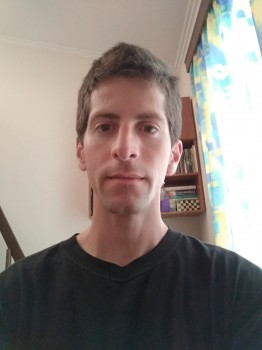

Aside
================================================================================

<i class="fas fa-download"></i> Download this resume in [PDF](https://bblodfon.github.io/my-cv/cv.pdf).

Contact Info {#contact}
--------------------------------------------------------------------------------

- <i class="fa fa-envelope"></i> bblodfon@gmail.com
- <i class="fa fa-envelope"></i> john.zobolas@ntnu.no
- <i class="fa fa-github"></i> [\@bblodfon](https://github.com/bblodfon)
- <i class="fab fa-researchgate"></i> [ResearhGate](http://tiny.cc/john-Re-gate)
- <i class="fab fa-skype"></i> bblodfon
- <i class="fa fa-phone"></i> +47 96808973
- <i class="fa fa-phone"></i> +30 6936586236

Skills {#skills}
--------------------------------------------------------------------------------
<i class="fab fa-r-project"></i> `R`

<i class="far fa-chart-bar"></i> `tidyverse`

<i class="fab fa-js"></i> `Javascript`

<i class="fab fa-html5"></i> `HTML`

<i class="fab fa-css3-alt"></i> `CSS`

<i class="fab fa-java"></i> `Java`

<i class="fab fa-python"></i> `Python`

<i class="fas fa-code-branch"></i> `Git`

Disclaimer {#disclaimer}
--------------------------------------------------------------------------------

Last updated on `r Sys.Date()`.

Main
================================================================================

John Zobolas {#title}
--------------------------------------------------------------------------------

I have a diverse background, from mathematics and computer science, to software engineering and modeling.
My strongest quality is careful, analytical thinking.
I like writing clean and test-driven software that enables technology-driven applications, as well as analyzing and visualizing research data to augment understanding of model-driven biological processes.

Education {data-icon=graduation-cap data-concise=true}
--------------------------------------------------------------------------------

### Norwegian University of Science and Technology (NTNU)

PhD in Computational Biology

Trondheim, Norway

2021 (expected) - 2017

**Thesis:** *Software implementations allowing new approaches toward data analysis, modeling and curation of biological knowledge for Systems Medicine* 

### Athens University of Economics and Business (AUEB)

MSc in Computer Science

Athens, Greece

2015 - 2013

**Thesis:** *SkyLighting Web Application with three.js*   
Diploma grade: **9.4**

### National Technical University of Athens (NTUA)

M.Eng in Electrical and Computer Engineering

Athens, Greece

2013 - 2007

**Thesis:** *Optimal Power Allocation in the uplink of Two-Tier Wireless Femtocell 
Networks*   
Diploma grade: **8.4**

Professional Experience {data-icon=suitcase data-concise=true}
--------------------------------------------------------------------------------

### Digital Life Norway Industry Internship (3 months)

AstraZeneca

Gothenburg, Sweden

2021

- Predicting bioactivity data using Bayesian Matrix Factorization
- Target clustering and validation for phenotypic screens

### Linux Systems Engineer and Database Performance Tester

Commsquare

Athens, Greece

2015 - 2013

- Administration/Monitoring of Linux servers & Databases
- Database Performance tuning (optimizing queries, insertion speed)
- Costumer support / Troubleshooting
- Software testing

\newpage 

Publications {data-icon=book data-concise=true}
--------------------------------------------------------------------------------

### CausalBuilder: bringing the MI2CAST causal interaction annotation standard to the curator
[Database](https://doi.org/10.1093/database/baaa107)

N/A

2021

Touré V, **Zobolas J.**, Kuiper M., Vercruysse S.

### Linking PubDictionaries with UniBioDicts to support Community Curation
[BioHackrXiv](https://doi.org/10.37044/osf.io/gzfa8)

N/A

2020

**Zobolas J.**, Kim J-D, Kuiper M., Vercruysse S.

### UniBioDicts: Unified access to biological dictionaries
[Bioinformatics](https://doi.org/10.1093/bioinformatics/btaa1065)

N/A

N/A

**Zobolas J.**, Touré V., Kuiper M., Vercruysse S.

### VSM-box: general-purpose interface for biocuration and knowledge representation
[Preprints](https://doi.org/10.20944/preprints202007.0557.v1)

N/A

N/A

Vercruysse, S., **Zobolas J.**, Touré V., Andersen M.K., Kuiper M.

### emba: R package for analysis and visualization of biomarkers in boolean model ensembles
[Journal of Open Source Software](https://doi.org/10.21105/joss.02583)

N/A

N/A

**Zobolas J.**, Kuiper M., Flobak Å.

### CausalTAB: the PSI-MITAB 2.8 updated format for signalling data representation and dissemination
[Bioinformatics](https://doi.org/10.1093/bioinformatics/btz132)

N/A

2019

Perfetto L., ..., **Zobolas, J.**, Licata L.

Posters {data-icon=file data-concise=true}
--------------------------------------------------------------------------------

### DrugLogics: An ensemble model analysis related to drug prediction performance

[Poster](https://doi.org/10.7490/f1000research.1116420.1) presented at the [55th 
NBS contact meeting](https://www.biokjemisk.no/contact-meeting-2019/)

Roros, Norway

2019

**Zobolas J.**, Vazquez M., Kuiper M., Flobak Å.

### VSM-box: the general-purpose curation interface as an open-source web-component

[Poster](https://doi.org/10.7490/f1000research.1116577.1) presented at the [The 12th International Biocuration Conference 2019](https://www.biocuration2019.org/)

Cambridge, UK

N/A

Vercruysse S., **Zobolas J.**, Touré V., Kuiper M.

Awards and Scholarships {data-icon=award}
--------------------------------------------------------------------------------
### Program *Study with Scholarship*, EqualSociety

Scholarship for the MSc in Computer Science (AUEB)

N/A

2013

### Program *Great Moment for Education*, Eurobank

Award for the highest grade in the Panhellenic examinations

N/A

2007

Music {data-icon=music data-concise=true}
--------------------------------------------------------------------------------

### Youtube [<i class="fab fa-youtube"></i>](https://www.youtube.com/c/JohnZobolas)

I maintain a youtube channel where I upload piano music

N/A

2014

### Pianist

Worked as a pianist in Konstantinidis pastry shops

Goudi, Athens

2012 - 2009

### School of Piano and Harmony

Graduated with honors from Anagennisi Conservatory

Athens, Greece

2007 - 2000

Recreational Activities {data-icon=walking}
--------------------------------------------------------------------------------

### [Juggling](https://www.instagram.com/bblodfon312/), unicycling, fitness training
