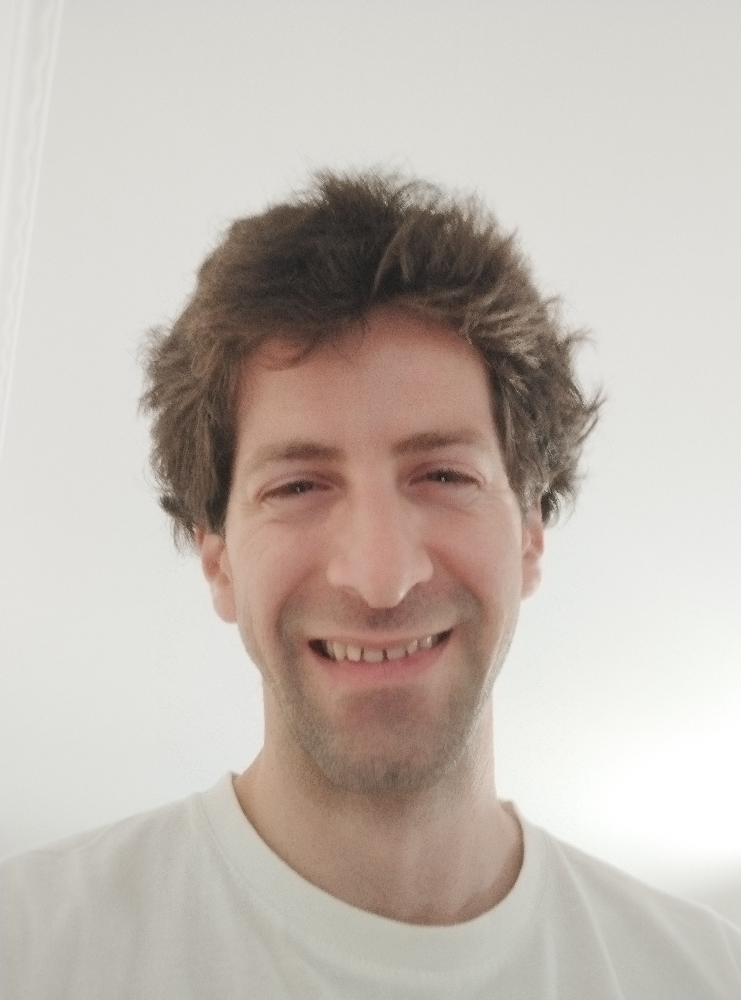

<!-- newest free version of fontawesome --->
<link rel="stylesheet" href="https://cdnjs.cloudflare.com/ajax/libs/font-awesome/7.3.0/css/all.min.css">

Aside
================================================================================

</img>

Contact Info {#contact}
--------------------------------------------------------------------------------

- <i class="fa-solid fa-envelope"></i> bblodfon [at] gmail [dot] com
- <i class="fa-brands fa-github"></i> [github.com/bblodfon](https://github.com/bblodfon){target="_blank"}
- <i class="fa-solid fa-phone"></i> +47 96808973

Skills {#skills}
--------------------------------------------------------------------------------
<i class="fa-brands fa-r-project"></i>

Books {#book}
--------------------------------------------------------------------------------

*8 Rules to write a PhD Thesis* [<a href="https://bblodfon.github.io/phd-rules/index.html" target="_blank">Online GitBook</a> <i class="fab fa-github"></i>]

Disclaimer {#disclaimer}
--------------------------------------------------------------------------------

<!-- Last updated on `r Sys.Date()`. -->

Main
================================================================================

John Zobolas {#title}
--------------------------------------------------------------------------------

<b>Researcher in Clinical AI and Computational Statistics</b> with a background in computer science, software engineering and computational biology.
My research focuses on machine learning for <b>cancer research</b>, particularly <b>survival analysis</b> and high-dimensional <b>biomarker discovery</b>.
I am a core contributor to the open-source <a href="https://mlr-org.com/">mlr3</a> R ecosystem for machine learning and maintainer of <a href="http://github.com/mlr-org/mlr3proba">mlr3proba</a> and several CRAN packages, including <a href="https://cran.r-project.org/web/packages/CoxBoost/index.html">CoxBoost</a> and <a href="https://cran.r-project.org/web/packages/fastVoteR/index.html">fastVoteR</a>.

Research Experience {data-icon=computer data-concise=true}
--------------------------------------------------------------------------------

### Researcher in Clinical AI

Oslo University Hospital

Oslo

Present - Oct 2025

- Machine learning for survival analysis and cancer research
- High-dimensional, multi-omics feature selection
- Adverse-event modeling
- Development of open-source statistical/ML software

### Postdoc Researcher in Clinical AI for Pancreatic Cancer

Oslo University Hospital

Oslo

Sept 2025 - Jan 2022

- PANCAIM: <b>PAN</B>creatic <b>C</b>ancer <b>AI</b> for genomics and personalized <b>M</b>edicine [[website](https://pancaim.eu/)]
- Authored two EU project deliverables [<a href="https://zenodo.org/communities/pancaim/" target="_blank">Zenodo</a>]
- Co-organized seminars at the Cancer Research Institute
- Visiting Fellow, Center for Advanced Studies, LMU (Winter 2024/25)

### Internship in Molecular AI group

AstraZeneca

Gothenburg

April 2021 - Jan 2021

<i class="fa-solid fa-diagram-project"></i> *Predicting bioactivity data using Matrix Factorization for target-based clustering and validation*

### Research stay in Molecular Interactions Team

European Bioinformatics Institute

Hinxton, England

July 2018

<i class="fa-solid fa-diagram-project"></i> *Extending the PSICQUIC Java-based Web service platform to include causality information of molecular interactions*

Industry {data-icon=suitcase data-concise=true}
--------------------------------------------------------------------------------

### Linux Systems Engineer

Commsquare

Athens

2015 - 2013

\newpage

Education {data-icon=graduation-cap data-concise=true}
--------------------------------------------------------------------------------

### PhD in Computational Biology

Norwegian University of Science and Technology (NTNU)

Trondheim

2021 - 2017

<i class="fa-regular fa-file-lines"></i> *Software implementations allowing new approaches toward data analysis, modeling and curation of biological knowledge for Systems Medicine*
[<a href="https://bblodfon.github.io/my-phd-thesis/" target="_blank">link</a> <i class="fab fa-github"></i>] [<a href="http://tiny.cc/john-phd-defence" target="_blank">Defence video</a> <i class="fab fa-youtube"></i>] [<a href="http://tiny.cc/john-phd-results" target="_blank">Results</a>] [<a href="http://tiny.cc/john-phd-diploma" target="_blank">Diploma</a>]

### MSc in Computer Science

Athens University of Economics and Business (AUEB)

Athens

2015 - 2013

<i class="fa-regular fa-file-lines"></i> *SkyLighting Web Application with three.js* [<a href="https://github.com/bblodfon/skylighting-Web-app" target="_blank">link</a> <i class="fab fa-github"></i>] [<a href="http://tiny.cc/john-aueb-diploma" target="_blank">Diploma</a>]

### Diploma in Electrical and Computer Engineering

National Technical University of Athens (NTUA)

Athens

2013 - 2007

<i class="fa-regular fa-file-lines"></i> *Optimal Power Allocation in the uplink of Two-Tier Wireless Femtocell
Networks* [<a href="https://github.com/bblodfon/femto-power-control" target="_blank">link</a> <i class="fab fa-github"></i>] [<a href="http://tiny.cc/john-ntua-diploma" target="_blank">Diploma</a>]

Publications {data-icon=book-open data-concise=true}
--------------------------------------------------------------------------------

### *Prognostic biomarker discovery in pancreatic cancer through hybrid ensemble feature selection and multi-omics data*, [BioData Mining](https://doi.org/10.1186/s13040-026-00546-0)

N/A

N/A

2026

### *A Large-Scale Neutral Comparison Study of Survival Models on Low-Dimensional Data*, [Bioinformatics](https://doi.org/10.1093/bioinformatics/btag186)

N/A

N/A

2026

### *mlr3extralearners: Expanding the mlr3 Ecosystem with Community-Driven Learner Integration*, [Journal of Open Source Software](https://doi.org/10.21105/joss.08331)

N/A

N/A

2025

### *Tutorial on survival modeling with applications to omics data*, [Bioinformatics](https://doi.org/10.1093/bioinformatics/btae132)

N/A

N/A

2024

### *Boolean function metrics can assist modelers to check and choose logical rules*, [Journal of Theoretical Biology](https://doi.org/10.1016/j.jtbi.2022.111025)

N/A

N/A

2022

Funding {data-icon=award}
--------------------------------------------------------------------------------
### Olav Raagholt and Gerd Meidel Raagholt Grant

<i class="fa-solid fa-circle-arrow-right"></i> 30,000 NOK, *Advancing Machine Learning Methods for Survival Analysis in Cancer Research*.

N/A

2025

### Astri and Birger Torsteds Grant to Fight Cancer

<i class="fa-solid fa-circle-arrow-right"></i> 50,000 NOK, IT equipment for cancer research within PANCAIM.

N/A

2024

Supervision {data-icon=people-carry-box}
--------------------------------------------------------------------------------

### Alberto López
PhD student

N/A

2026 - 2023

<i class="fa-solid fa-diagram-project"></i> *Incomplete Multi-View Clustering Algorithms*

### Philip Studener & Markus Goeswein
Student Assistants (LMU)

N/A

2025 - 2024

<i class="fa-solid fa-diagram-project"></i> *Implementation of Reduction Techniques for Survival Analysis in mlr3proba* [[Lifetime Data Analysis](https://doi.org/10.1007/s10985-026-09714-0) <i class="fa-regular fa-file-lines"></i>]

### Laura Szekeres
Master student

N/A

2025 - 2024

<i class="fa-solid fa-diagram-project"></i> *Cancer Treatment gets Logical: An Ensemble Boolean Modeling Pipeline in Python* [<a href="https://github.com/druglogics/pydruglogics" target="_blank">PyDrugLogics</a> <i class="fab fa-github"></i>] [[JOSS](https://doi.org/10.21105/joss.08038) <i class="fa-regular fa-file-lines"></i>]

### Tanguy Dumontier
Apprentice Data Engineer

N/A

2024

<i class="fa-solid fa-diagram-project"></i> *Optimizing Incomplete Multi-View Clustering: From MATLAB to Python* [<a href="https://github.com/ocbe-uio/imml" target="_blank">iMML</a> <i class="fab fa-github"></i>]

### Hedda Fjell Scheel
Veterinary Research Student (Forskerlinjestudent)

N/A

2024 - 2023

<i class="fa-solid fa-diagram-project"></i> *Genetic Heterogeneity of Canine Mammary Tumors* [[Veterinary Oncology](https://doi.org/10.1186/s44356-025-00030-7) <i class="fa-regular fa-file-lines"></i>]

Invited Talks, Tutorials & Conferences {data-icon=chalkboard-user}
--------------------------------------------------------------------------------

### Intro to Machine Learning for Survival Analysis with mlr3

userR! 2024 [<a href="https://survival-org.github.io/user2024-survival-mlr3/" target="_blank">tutorial</a> <i class="fab fa-github"></i>]

Salzburg

2024

### Examining Properness in the External Validation of Survival Models with Squared and Logarithmic Losses

NORA Annual Conference 2024 [[slides](http://tiny.cc/scoring-rules-2024) <i class="fa-brands fa-slideshare"></i>]

Kristiansand

2024

### AI pitch: An Example ML Survival Workflow

NORBIS Annual Conference 2022 [[slides](http://tiny.cc/norbis-2022) <i class="fa-brands fa-slideshare"></i>]

Rosendal

2022

### Reproducible Science
Logical Modeling Course (Trondheim, NTNU) [[slides](https://tiny.cc/reproducibility) <i class="fa-brands fa-slideshare"></i>]

N/A

2022

Teaching {data-icon=person-chalkboard}
--------------------------------------------------------------------------------

### ML Course for Cancer Researchers
Institute for Cancer Research in Oslo [[Trees&Ensembles](http://tiny.cc/trees-ensembles), [SVMs](http://tiny.cc/svm-intro), [NNs](http://tiny.cc/nn-intro) <i class="fa-brands fa-slideshare"></i>, [Benchmarking](https://github.com/bblodfon/ml-course-2022/) <i class="fa-brands fa-github"></i></i>]

N/A

2022

Recreational {data-icon=person-through-window}
--------------------------------------------------------------------------------

### Piano

N/A

N/A

- <a href="https://www.youtube.com/c/JohnZobolas" target="_blank">YouTube channel</a> <i class="fab fa-youtube"></i> <i class="fas fa-music"></i>
- Concerts for cancer patients ([Solo](https://kreftforeningen.no/vardesenteret/tilbud/pianokonsert-med-john/) & [4-hands](https://kreftforeningen.no/vardesenteret/tilbud/pianokonsert/) with Liliane Christ)

### Juggling

N/A

N/A

- <a href="https://www.instagram.com/bblodfon312/" target="_blank">Instagram channel</a> <i class="fab fa-instagram"></i>
